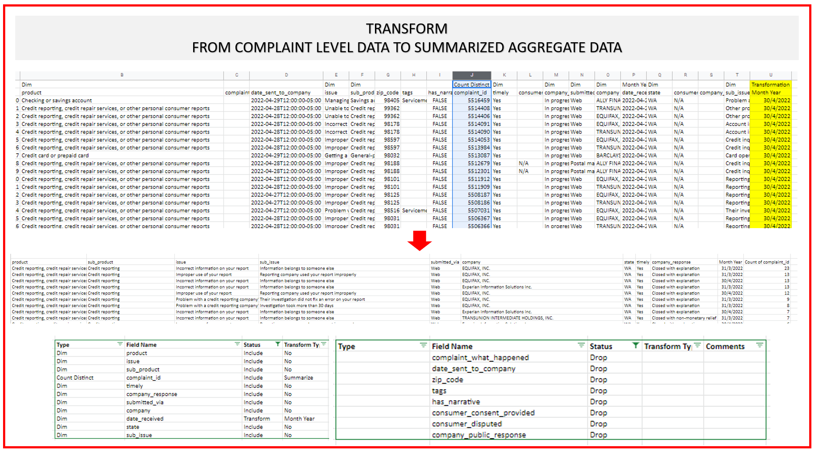

# Pipe-Data-with-Airflow-Task-Part-1
 
 `TASK : SCRAP - INGEST - ORCHESTRATE - DEPLOY`

## Preamble:
`- This Task will be testing all your previously learned knowledge to demonstrate a integrated understanding of process involved to bring data into useful information with process such as Acquisition, Transformation, Orchestration and Delivery/Deployment on Cloud`

`Please note this is Part 1 of Task, We will have part 2 when StreamLit is Completed.`

## Context:
`You are working as a Data Engineer for Consumer Financial Protection Bureau and this is a critical task assigned to you by the Director Data Engineering, which guarantees your confirmation at the workplace!`

## About CFBP:
`- The Consumer Financial Protection Bureau is a U.S. government agency that makes sure banks, lenders, and other financial companies treat you fairly.`

## Task details: <An excerpt from the Email>

  ```
  Hi,

  We have a frequent request from our internal stakeholders to be provided with an upto date dashboard for their monitoring purpose., 

  For your ease, we already have an API available for consumption which has parameters of State, From Date, To Date, you can sample fetch data from it.

  Here is the Example API : https://www.consumerfinance.gov/data-research/consumer-complaints/search/api/v1/?size=500&date_received_max=2021-11-02&date_received_min=2020-11-02&state=WA

  We need you to design a complete architecture as state below:

  1. Setup Complete Backend with Airflow as per "Airflow Instruction Tab" File Attached
  2. Design a Dashboard Front End with Streamlit as per "StreamLit Instruction Tab" File Attached

  We will evaluate you on the basis of: (Make a Zip File with Following)

  1. A Folder with Airflow DAG and Modular E T L Scripts as mentioned in Instruction Document (Submit a .py Files) - (60 Marks)

  Regards,
  Mr. John Thompson
  Director Data Engineering


---------------------------------------------------------------------------------------------------------------------------------------------------------------------------------------------------------------------------

  
  For your assistance, Below are some Code Snippets for your intuition:
  
  1. How to get all US States: You will use this list for Recursion on API to get all states Data.
  
  list_of_states=list(requests.get("https://gist.githubusercontent.com/mshafrir/2646763/raw/8b0dbb93521f5d6889502305335104218454c2bf/states_hash.json").json().keys())
  
  2. API Hit URL
  
  url = 'https://www.consumerfinance.gov/data-research/consumer-complaints/search/api/v1/?field=complaint_what_happened&size={size}&date_received_max={}&date_received_min={}&state={}'
  
  3. Example Scrapping of Data for Washington State for Today (Remember : You have to put a Loop through all States)
  
  from datetime import date, datetime, timedelta
  
  size=500
  time_delta=365
  max_date = (date.today()).strftime("%Y-%m-%d")
  min_date = (date.today() - timedelta(days=time_delta)).strftime("%Y-%m-%d")
  
  state='WA'
  
  print(url.format(size,max_date, min_date, state))
  
  import requests
  
  results=requests.get(url.format(size,max_date, min_date, state)).json()
  
  4. Dumping Data into Google Sheets : See Mentioned Video and Code Repo 
```

------------------------------------------------------------------------------------------------------------------------------------------------------------------------------------------------------------------------------------------------------




